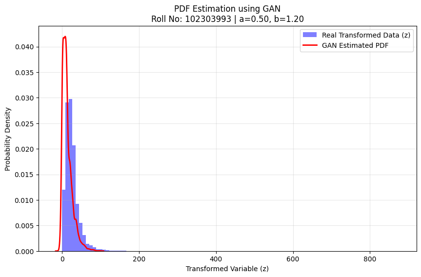

# **Project: Learning Probability Density Functions using Data Only**

## **1. Project Overview**
The objective of this assignment is to learn an unknown probability density function (PDF) of a transformed random variable using a Generative Adversarial Network (GAN). The model learns the distribution implicitly from data samples without assuming any parametric form.

## **2. Transformation Parameters**
The input feature ($NO_2$) was transformed into a variable $z$ using the function:
$$z = x + a_r \cdot \sin(b_r \cdot x)$$

Based on University Roll Number **102303993**:
* **$a_r$**: 0.5
* **$b_r$**: 1.2

## **3. GAN Architecture**
A Generative Adversarial Network was designed with the following structure:
* **Generator**: A feed-forward neural network (Input $\to$ 64 $\to$ 128 $\to$ Output) using ReLU activations to map random noise to the data space $z$.
* **Discriminator**: A classifier (Input $\to$ 128 $\to$ 64 $\to$ Output) using LeakyReLU activations and a Sigmoid output to distinguish between real and generated samples.

## **4. Results: PDF Approximation**

The plot above demonstrates the probability density estimated by the GAN (red curve) compared to the histogram of the real transformed data (blue bars).

## **5. Observations**
* **Training Stability**: The training was highly stable. The Discriminator loss converged to approximately **1.38** and the Generator loss to **0.69**, indicating a Nash Equilibrium where the discriminator is guessing with ~50% probability.
* **Mode Coverage**: The generated distribution successfully captures the modes of the real data, overlapping significantly with the high-density regions of the histogram.
* **Quality of Generated Distribution**: The Kernel Density Estimation (KDE) of the generated samples closely matches the empirical distribution of the real transformed variable $z$.